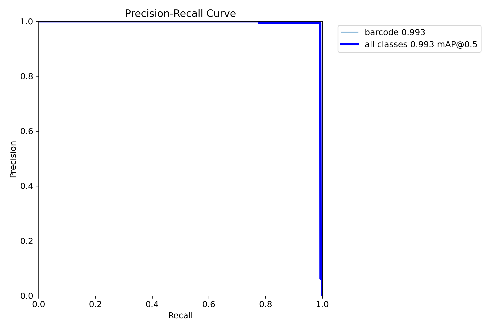
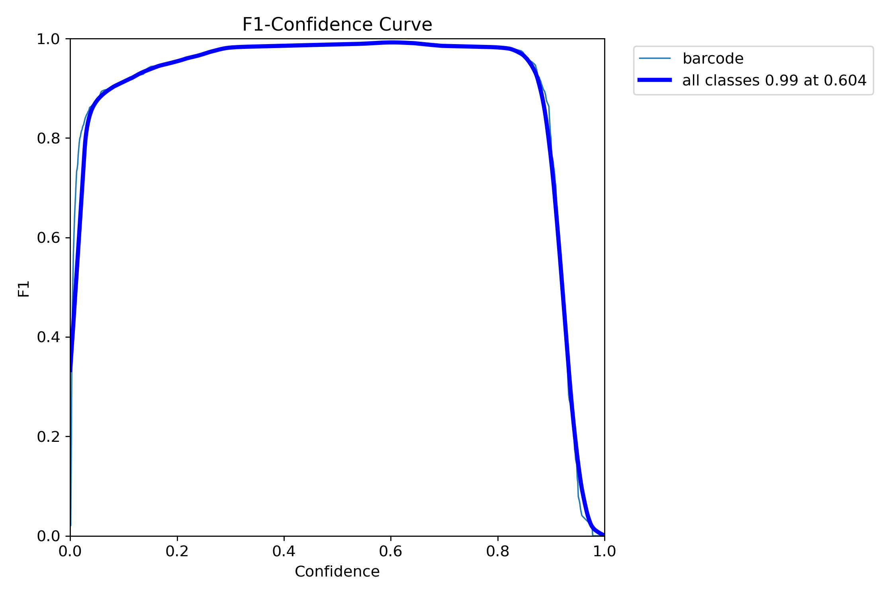
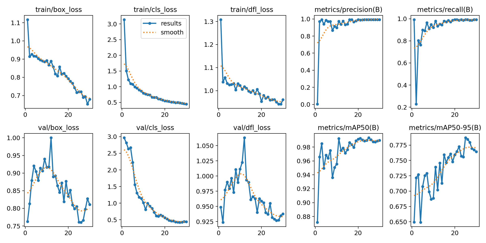
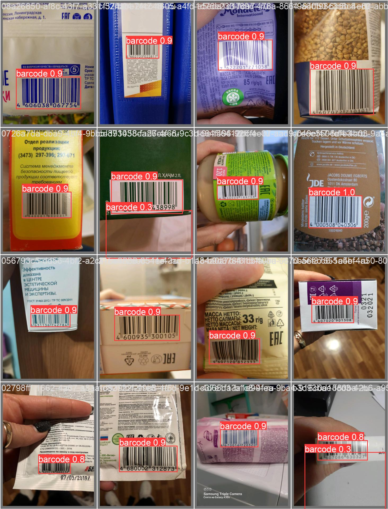
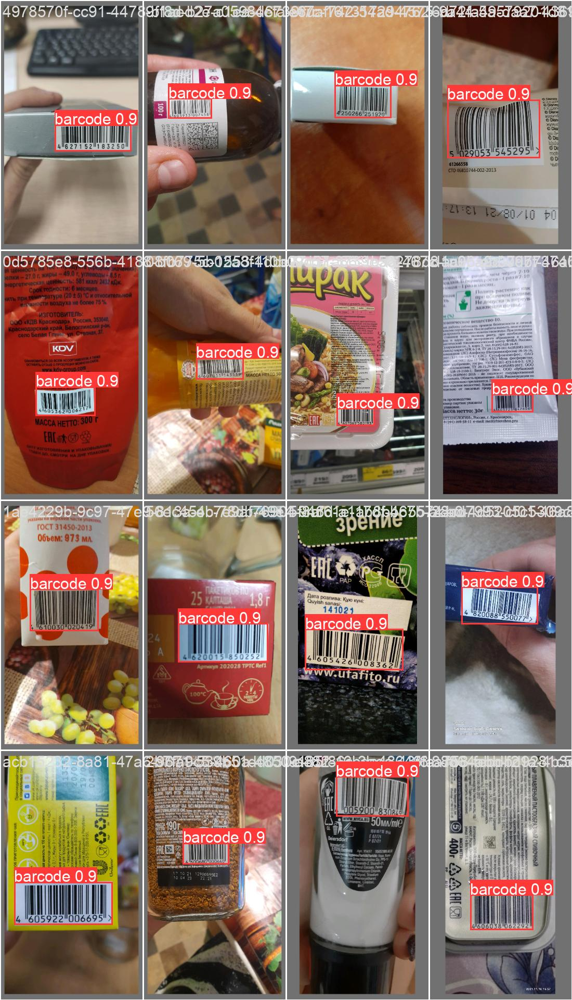

# Модель детекции штрихкодов

## Цель проекта
С помощью алгоритмов детекции правильно локализовать штрихкод

## Данные
Датасет, собранный на Толоке в формате tsv, где есть информация о позиции штрихкода

Для тренировки и валидации данные разбиты в таком формате:

|  train | val    
| ------ | -------
|  337   |   144    

## Результаты
При запуске самой маленькой YOLOv8 со стандартными настройками удалось выбить 0.994 mAP@50, эта модель выгружена в ONNX для дальнейшего инференса и особых экспериментов кроме изменения размеров изображения не производилось

Графики показывают очень хорошие результаты модели

 

На изображениях можно заметить FP срабатывания, но они имеют невысокую уверенность, поэтому их можно будет убрать по порогу
